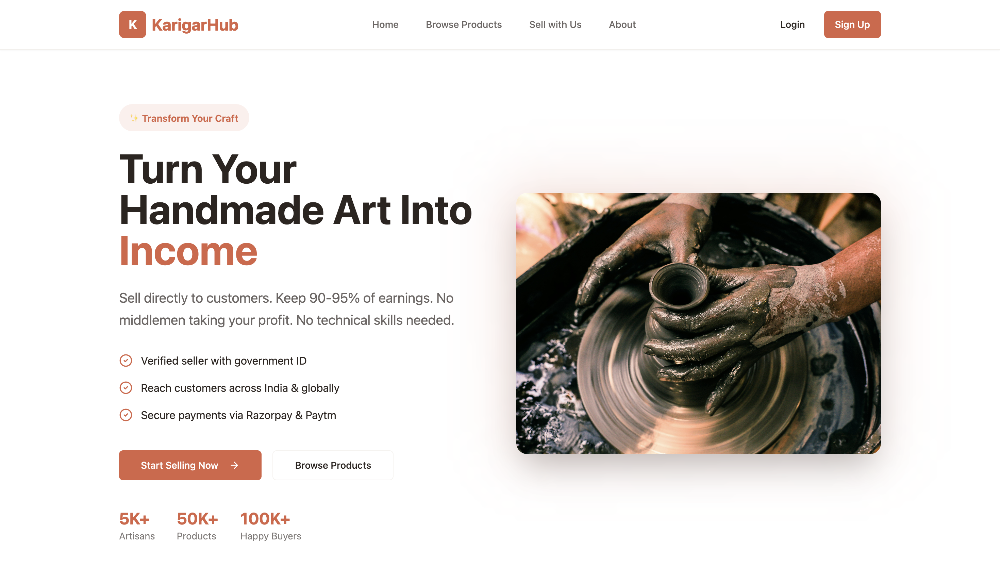
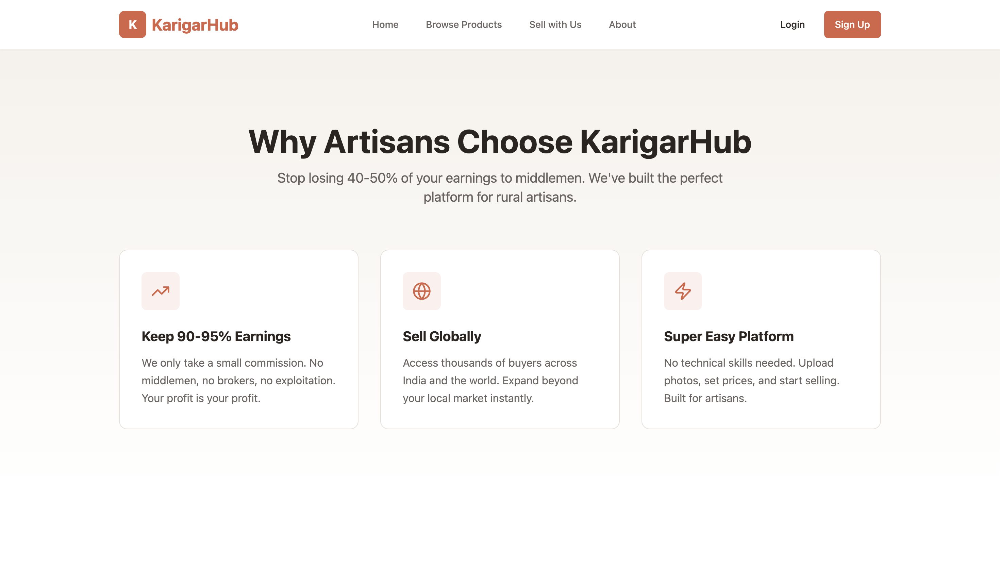
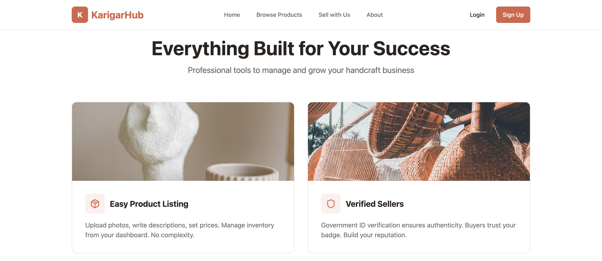
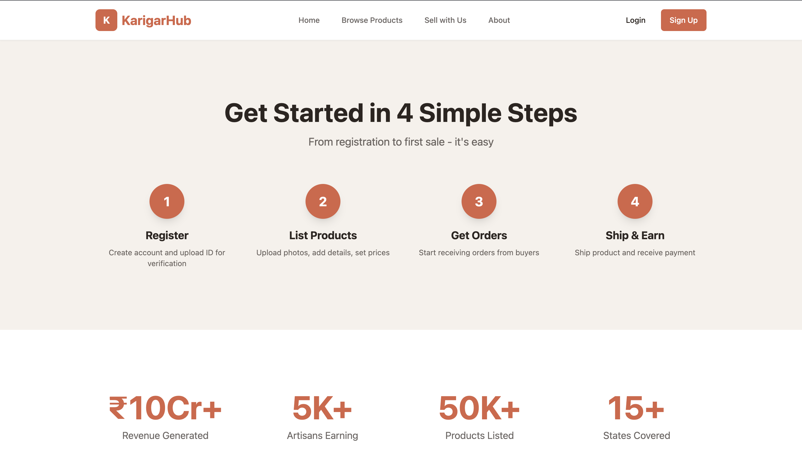
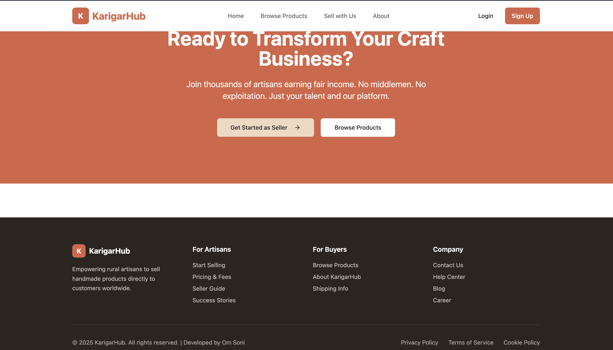
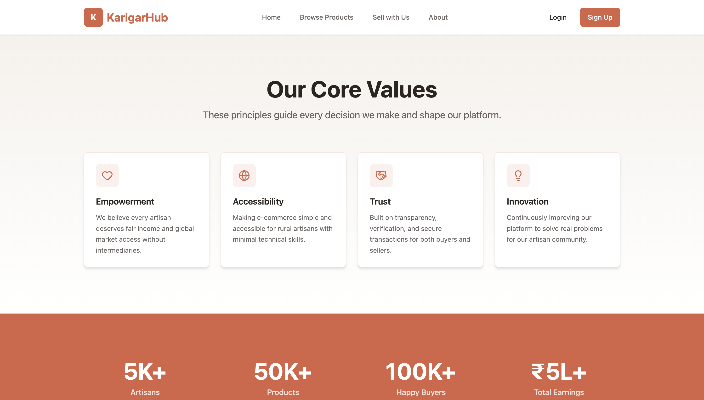
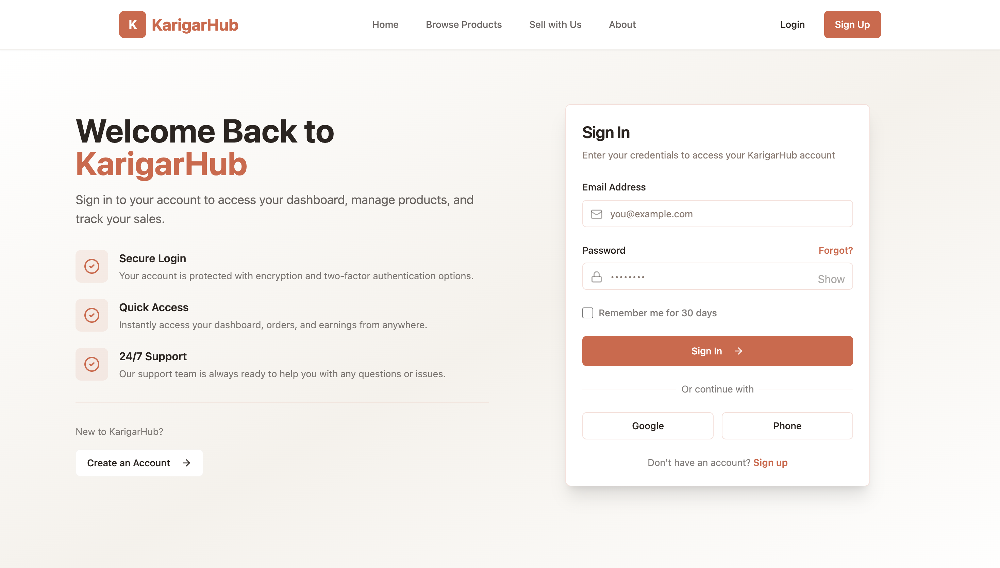
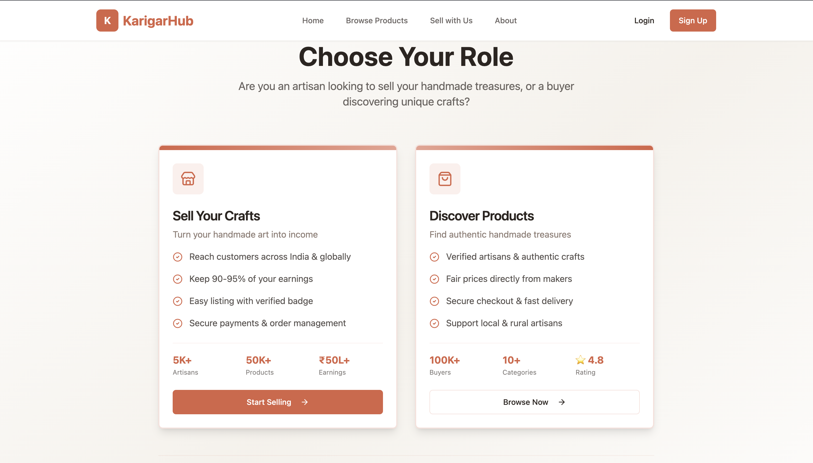
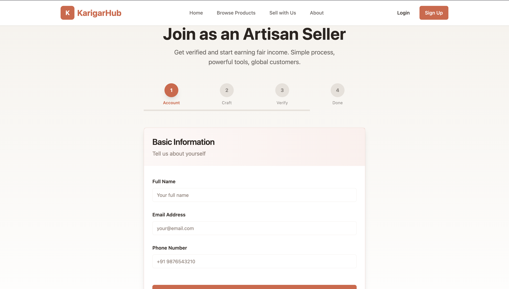
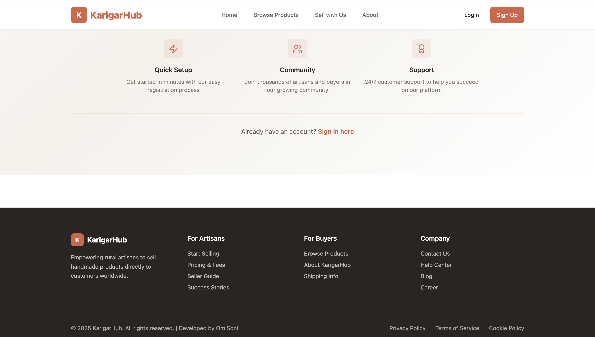

# 🎨 KarigarHub – Frontend (Handicraft Marketplace UI)

KarigarHub is a **modern frontend UI** for a handicraft marketplace platform designed to empower **rural artisans** by giving them direct access to customers.  
This repository contains **only the frontend**, built using React, TypeScript, and Tailwind CSS with a strong focus on clean UI/UX and responsiveness.

---

## 🖼️ Screenshots (UI Preview)

### 🏠 Home Page

  
  
  
  
  

### ℹ️ About Page

  
  
  

### 🛍️ Browse Products

  
  

### 🔐 Login & Signup

  
  

### 🧑‍🎨 Sell With Us

  

### 🦶 Footer

  

---

## 📌 Status

- ✅ Frontend UI completed
- ⏳ Backend & API integration pending
- ⏳ Payments & authentication pending

---

## 👤 Author

**Om Soni**  
Frontend / Full-Stack Developer

---

## 📄 License

MIT License

---

**Made with ❤️ to support rural artisans**

## 🚀 Key Highlights

- 🧑‍🎨 Artisan-focused marketplace interface
- 🛍️ Buyer & Seller role-based screens
- 📊 Seller dashboard UI
- 📱 Fully responsive design
- ⚡ Fast performance with Vite
- 🎨 Clean UI using Tailwind CSS & shadcn/ui

---

## 🖥️ Pages Included

- **Home** – Landing page & platform overview 
- **About** – Mission, vision & impact  
- **Browse Products** – Marketplace UI  
- **Login** – Authentication UI  
- **Signup** – Buyer / Seller role selection  
- **Sell With Us** – Artisan onboarding  
- **Dashboard** – Seller management UI  

---

## 🛠️ Tech Stack (Frontend)

- **React 18 + TypeScript**
- **Vite**
- **Tailwind CSS**
- **shadcn/ui**
- **React Router**
- **Axios**
- **Lucide Icons**

---

## 📁 Project Structure

